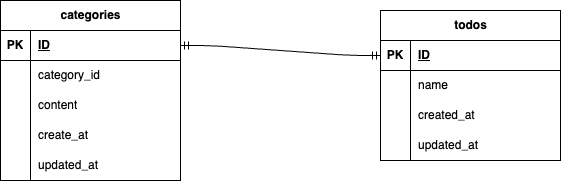

# laravel-docker-template

# ◯◯◯◯◯（アプリ名）
Todoアプリ
## 概要
シンプルなTodo管理アプリです。

## 環境構築手順

リポジトリをClone
`` `
git clone git@github.com:ogatatouya/Todo2.git
cd Todo2
`` `

Dockerを起動
`` `
docker compose up -d --build
`` `

envファイルの準備
`` `
cp src/.env.example src/.env
`` `

Laravelのセットアップ
`` `
docker-compose exec php bash
composer install
php artisan key:generate
php artisan php artisan migrate
php artisan db:seed
`` `

## 使用技術(実行環境)
- PHP 8.1
- Laravel 8.75
- MySQL 8.0.26

## ER図
# ER図

## 動作URL
- 開発環境：http://localhost/
- phpMyAdmin:：http://localhost:8080/